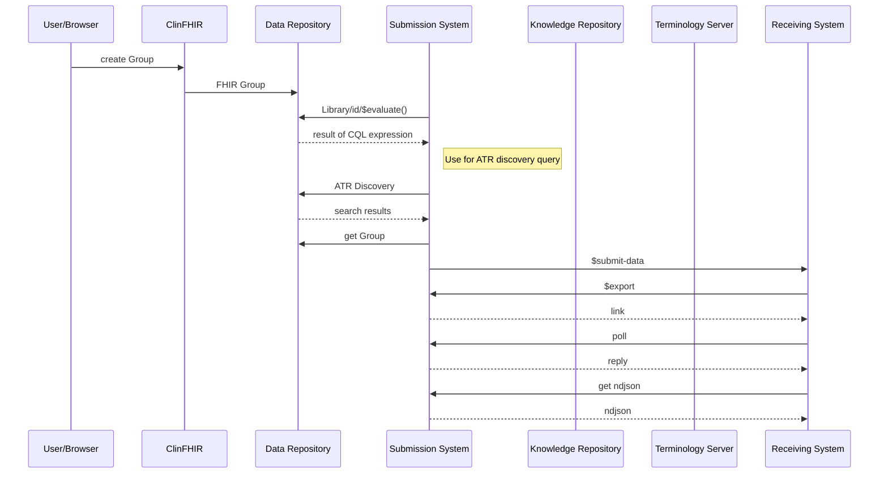

### Introduction

This implementation guide is a collection of draft FHIR-based electronic Clinical Quality Measures (eCQM) that conform to
the [FHIR Quality Measure IG](http://hl7.org/fhir/us/cqfmeasures)

> NOTE: The measures in this implementation guide are works in progress and should not be considered final specifications or recommendations for guidance. The examples will help guide and direct the process of finding conventions and usage patterns that meet the needs of the various stakeholders in the measure development community.

### Content

This implementation guides contains electronic Clinical Quality Measure (eCQM) specifications, published
as FHIR Measure and Library resources.

For a complete listing of the Measures in this IG, refer to the [Measures](measures.html) page.

### Mermaid sequence diagram test

